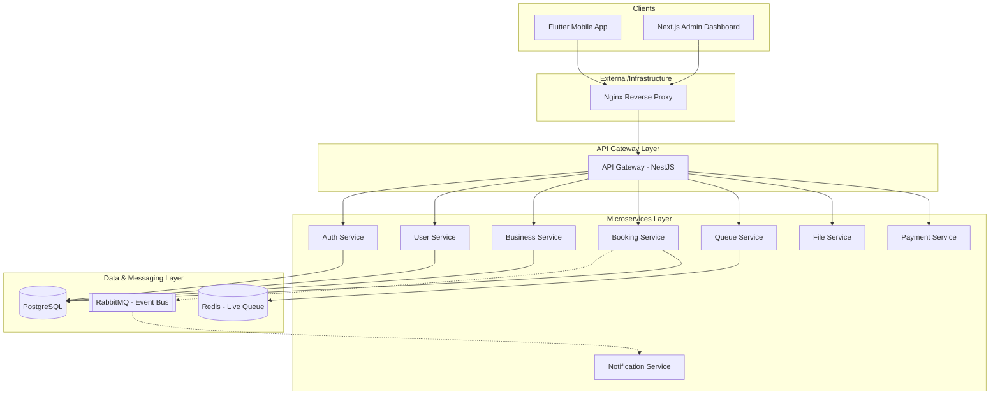
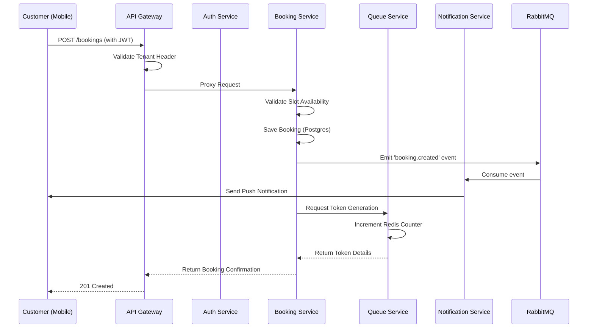

# Architecture Diagram

This document describes the high-level architecture of the Multi-tenant Booking & Queue Management Platform.

## System Overview

## Core Workflows

### 1. Booking Flow

## Key Components

### 1. API Gateway
- **Technology**: NestJS with `http-proxy-middleware`.
- **Role**: Entry point for all client requests. Handles routing, Swagger documentation aggregation, and global filters.

### 2. Microservices
- **Auth Service**: Manages identity, JWT issuance, and RBAC. Uses Prisma ORM with PostgreSQL.
- **Queue Service**: Manages real-time tokens and waiting times. Uses Redis for high-performance counter increments.
- **Booking Service**: Handles appointment scheduling and slot management.
- **Notification Service**: Asynchronous service that listens to RabbitMQ events and sends Push/SMS/Email notifications.

### 3. Multi-tenancy
- **Tenant Isolation**: Achieved via `tenantId` partitioning in the database and `TenantGuard` at the API layer.
- **Role-Based Access Control (RBAC)**: Enforced via `RolesGuard` to separate Customer, Receptionist, and Business Admin permissions.

### 4. Communication
- **Synchronous**: REST/HTTP for client-to-service and internal proxying.
- **Real-time**: WebSockets (Socket.io) in the Queue Service for live updates.
- **Asynchronous**: RabbitMQ for event-driven flows (e.g., "Booking Created" -> "Send Notification").

## Deployment
- **Production**: Linux/EC2 with PM2 for process management and Nginx as the edge proxy.
- **Local**: Docker Compose for infrastructure (Postgres, Redis, RabbitMQ) and local Node.js processes for services.
