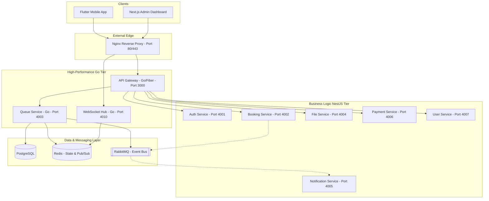

# Hybrid High-Performance Architecture

This document describes the refactored hybrid architecture of the Multi-tenant Booking & Queue Management Platform, optimized for high-performance single-server deployment.

## System Overview

## Refactoring Strategy

### 1. Performance Critical (Migrated to Go)
- **API Gateway**: Replaced NestJS implementation with Go + Fiber for ultra-low latency request routing and proxying.
- **Queue Service**: Rewritten in Go to handle high-concurrency token generation and queue management using Goroutines and optimized Redis access.
- **WebSocket Hub**: Dedicated Go service for managing thousands of concurrent WebSocket connections with low memory footprint.

### 2. Business Logic (Retained in NestJS)
- **Auth, Booking, Payment, Notification, File Services**: Kept in NestJS to leverage existing complex business logic, DTOs, and validation.

## Port Mapping

| Service | Technology | Port |
|---------|------------|------|
| API Gateway | Go / Fiber | 3000 |
| Auth Service | NestJS | 4001 |
| Booking Service | NestJS | 4002 |
| Queue Service | Go | 4003 |
| File Service | NestJS | 4004 |
| Notification Service | NestJS | 4005 |
| Payment Service | NestJS | 4006 |
| User Service | NestJS | 4007 |
| WebSocket Hub | Go | 4010 |

## Event-Driven Flow (RabbitMQ)

1. **BookingCreated**: Emitted by Booking Service -> Consumed by Notification Service.
2. **TokenGenerated**: Emitted by Queue Service -> Consumed by WebSocket Hub (via Redis Pub/Sub) and Notification Service.
3. **QueueUpdated**: Emitted by Queue Service -> Consumed by WebSocket Hub.

## Redis Architecture

- **Queue State**: Sorted sets for FIFO management.
- **Pub/Sub**: Used for real-time communication between Queue Service and WebSocket Hub.
- **Caching**: Session and frequently accessed business metadata.

## Single Server Deployment

- **Process Manager**: PM2 manages all Go binaries and NestJS processes.
- **Reverse Proxy**: Nginx handles SSL (Let's Encrypt), static file serving, and load distribution to the API Gateway.
- **Database**: Single PostgreSQL instance with logical schemas for service isolation.
